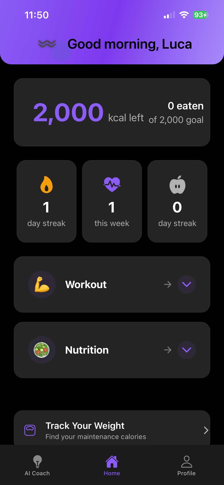

# Workout Wave

An AI-powered fitness companion app built with React Native and Expo.



## Features

### Workout Tracking
- Log workouts with detailed exercise tracking
- Track sets, reps, and weights for each exercise
- Personal record (PR) detection and celebration
- Workout calendar with history visualization
- Voice input for hands-free workout logging

### AI-Powered Assistance
- Natural language workout parsing
- Exercise recommendations based on your goals
- Form tips and exercise alternatives
- Meal suggestions based on your nutrition goals

### Nutrition Tracking
- Log meals with calorie and macro tracking
- Barcode scanning for quick food entry
- Recipe discovery and saving
- Daily/weekly nutrition insights
- TDEE calculator (Maintenance Finder)

### Progress & Goals
- Visual progress charts and statistics
- Achievement badges and streaks
- Customizable fitness goals
- Body measurements tracking

### Web Dashboard
- Sync your data across devices
- Import workouts and recipes from screenshots
- View detailed analytics on the web

## Tech Stack

- **Frontend**: React Native with Expo
- **Backend**: Firebase (Auth, Firestore)
- **AI**: OpenAI GPT-4 for natural language processing
- **Web**: React with Framer Motion

## Getting Started

### Prerequisites
- Node.js 18+
- npm or yarn
- Expo CLI
- Firebase project

### Installation

```bash
# Clone the repository
git clone https://github.com/Lucagamerbest/AI-Gym-Trainer.git

# Install dependencies
npm install

# Start the development server
npx expo start
```

### Environment Variables

Create a `.env.local` file with your API keys:

```
OPENAI_API_KEY=your_openai_key
FIREBASE_API_KEY=your_firebase_key
```

## Screenshots

<p align="center">
  
  
  
</p>

## License

This project is proprietary software.

## Contact

Created by Luca Rarau
